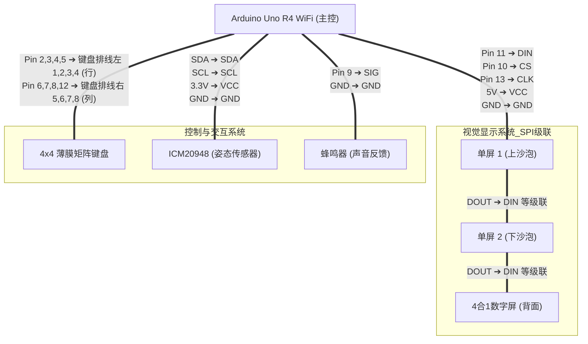

# 电子沙漏逻辑接线图 (Circuit Diagram)

> **电路正确性验证 (Verified)**: 
> 最新版本集成了矩阵键盘。我们利用了 Arduino 空闲的 8 个独立数字引脚（2~8, 12）处理键盘行列扫描。引脚分布完全避开了 SPI(10-13) 和 I2C(A4-A5)，整套系统在电气层面上无冲突，高度可靠。

```mermaid
flowchart TD
    MCU["Arduino Uno R4 WiFi (主控)"]
    
    subgraph 视觉显示系统_SPI级联
        M1["单屏 1 (上沙泡)"]
        M2["单屏 2 (下沙泡)"]
        M3["4合1数字屏 (背面)"]
    end
    
    subgraph 控制与交互系统
        KEYPAD["4x4 薄膜矩阵键盘"]
        IMU["ICM20948 (姿态传感器)"]
        BUZ["蜂鸣器 (声音反馈)"]
    end

    %% 屏幕接线
    MCU == "Pin 11 ➔ DIN\nPin 10 ➔ CS\nPin 13 ➔ CLK\n5V ➔ VCC\nGND ➔ GND" === M1
    M1 == "DOUT ➔ DIN 等级联" === M2
    M2 == "DOUT ➔ DIN 等级联" === M3
    
    %% 键盘接线
    MCU == "Pin 2,3,4,5 ➔ 键盘排线左 1,2,3,4 (行)\nPin 6,7,8,12 ➔ 键盘排线右 5,6,7,8 (列)" === KEYPAD

    %% 其他接线
    MCU == "SDA ➔ SDA\nSCL ➔ SCL\n3.3V ➔ VCC\nGND ➔ GND" === IMU
    MCU == "Pin 9 ➔ SIG\nGND ➔ GND" === BUZ
```
